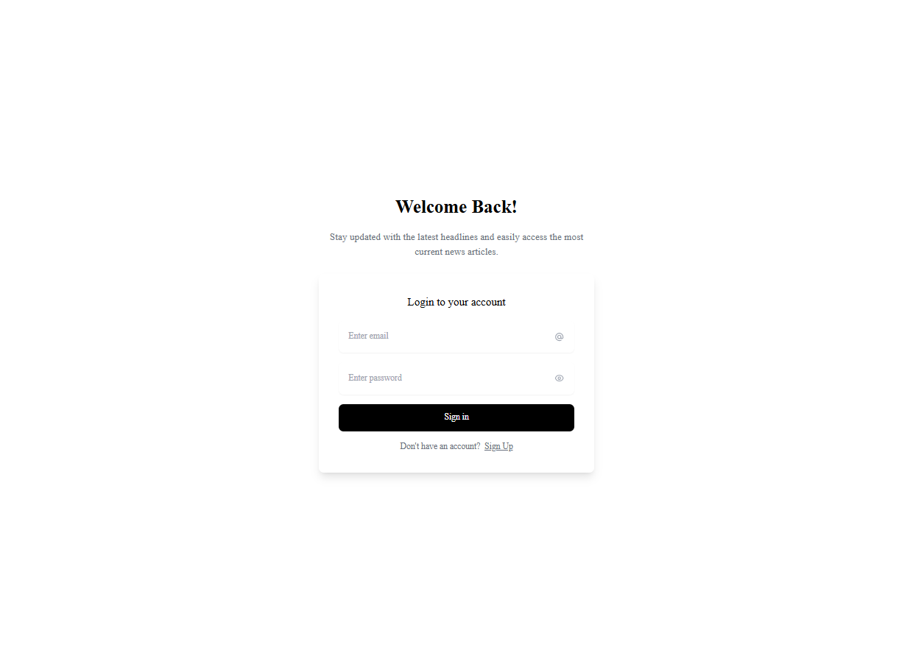

---

# **AI-Driven News Service**

---

## **Live Links**

* **Frontend**: [ai-news-service-20290.web.app/home](https://ai-news-service-20290.web.app/home)
* **Backend**: [ai-news-service-backend.vercel.app](https://ai-news-service-backend.vercel.app)

---

## **About the Project**

**AI-Driven News Service** is a full-stack web application that delivers real-time, personalized, and accessible news to users.
It integrates **AI features** like **summarization**, **multilingual translation**, and **text-to-speech (TTS)**, making news consumption faster, inclusive, and user-friendly.

---

## **Features**

*  **Real-Time News Aggregation** – Web scraping using Axios + Cheerio
*  **AI Summarization** – Shortens lengthy articles (Groq AI)
*  **Multilingual Support** – Translate into 100+ languages (Gemini API)
*  **Text-to-Speech (TTS)** – Listen to articles (React Speech Synthesis)
*  **Daily PDF Newspaper** – Download curated news for offline reading
*  **User Authentication** – Secure login and registration (Firebase Auth)
*  **Admin Panel** – Manage users, articles, and promotional content

---

## **Tech Stack**

* **Frontend**: React.js
* **Backend**: Node.js
* **Database & Auth**: Firebase Firestore, Firebase Authentication
* **AI APIs**: Groq AI (Summarization), Gemini API (Translation)
* **Other Tools**: Axios, Cheerio, jsPDF, React Speech Synthesis
* **Deployment**: Vercel (Frontend & Backend), Firebase Hosting

---

##  Screenshots

### Home Page  

### Login Page  

### News Page  

### Kerala Category Page  

### Manage News (Admin)  

### Manage Promotions (Admin)  

### Recent News Section  

---

